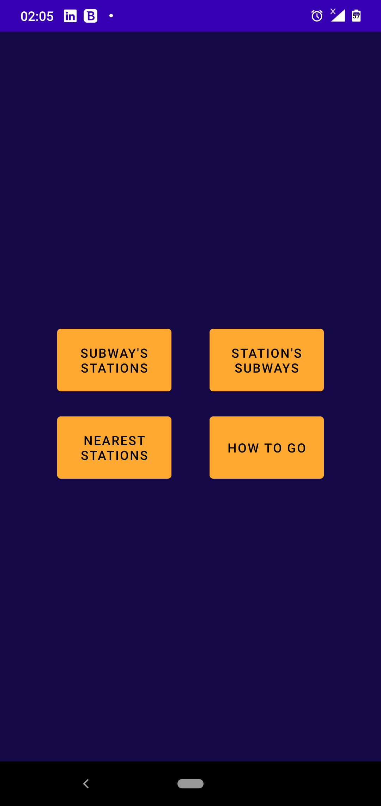
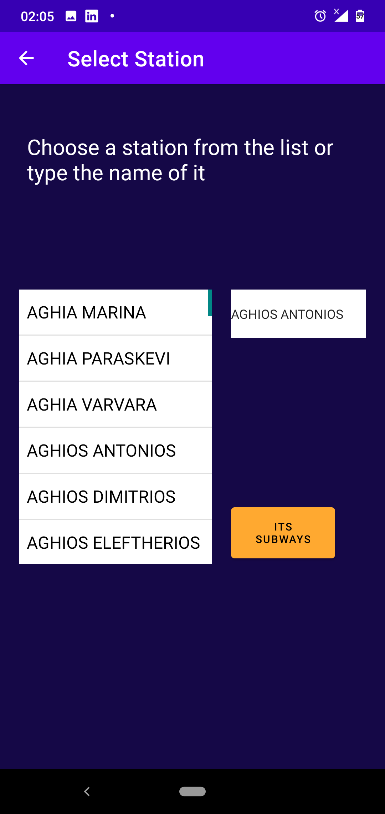
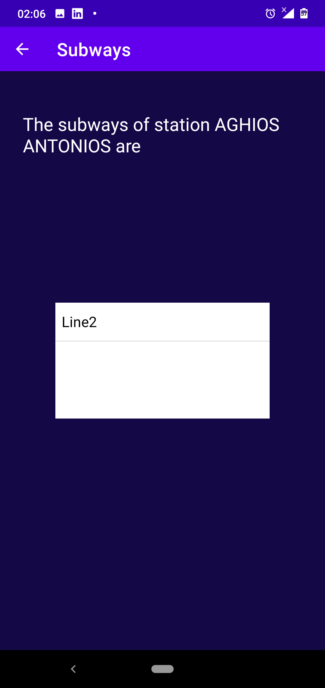
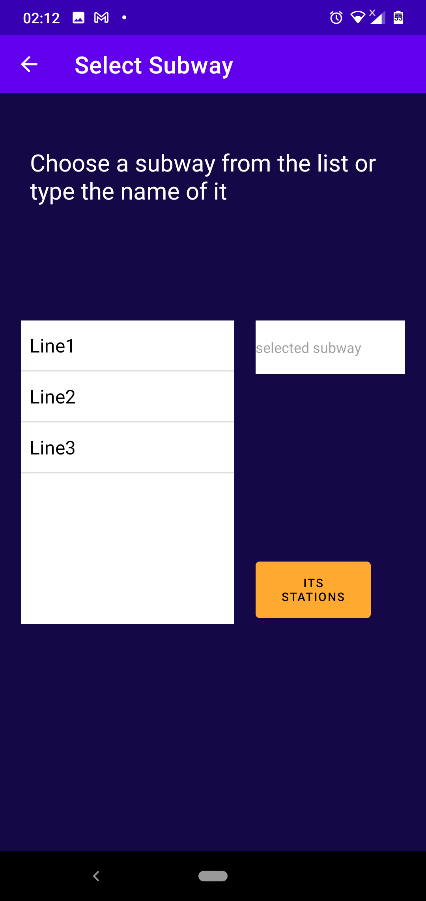
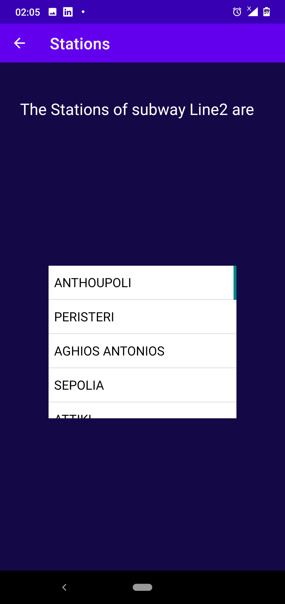
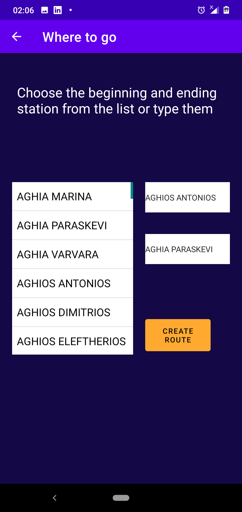
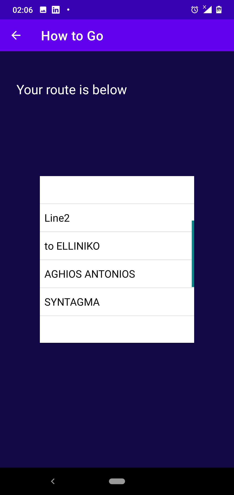
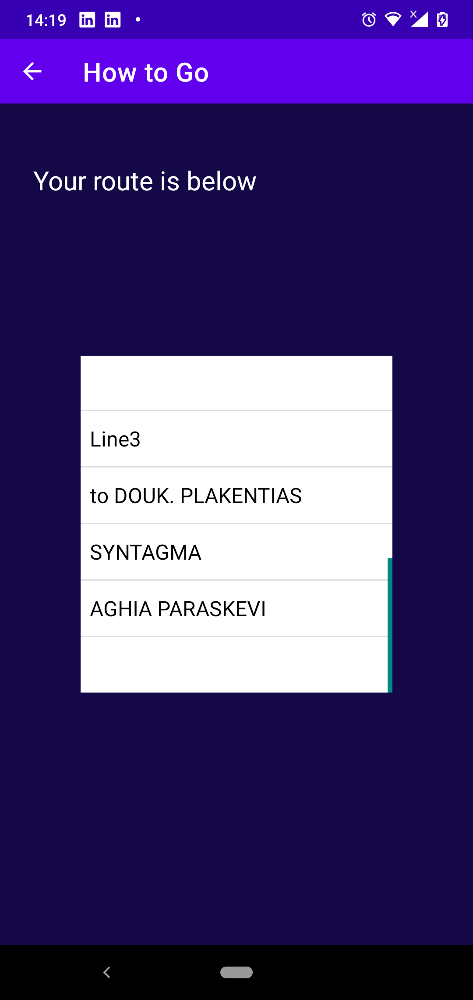

# Subway-Application-V3

This project is an extension of [Subway-Application-V2](https://github.com/ManosMorf97/Subways-Application-V2).

## Demo

YouTube [video](https://www.youtube.com/watch?v=WykQxeZfV9I)

#### Reminder 
The aim of this project is to create a mobile app using Software Engineering fundamentals.

The user can do four things:
1) See which buses stop at a station.
2) See the stations that a bus stops.
3) See the stations that are near to they.
4) Informed how to go from one specific station to another specific station.

#### Extras
* Better User Experience.
* Suitable for all mobile phones.

#### Snippets

##### Main

##### Station's Info

##### Subway's Info

##### How to go

